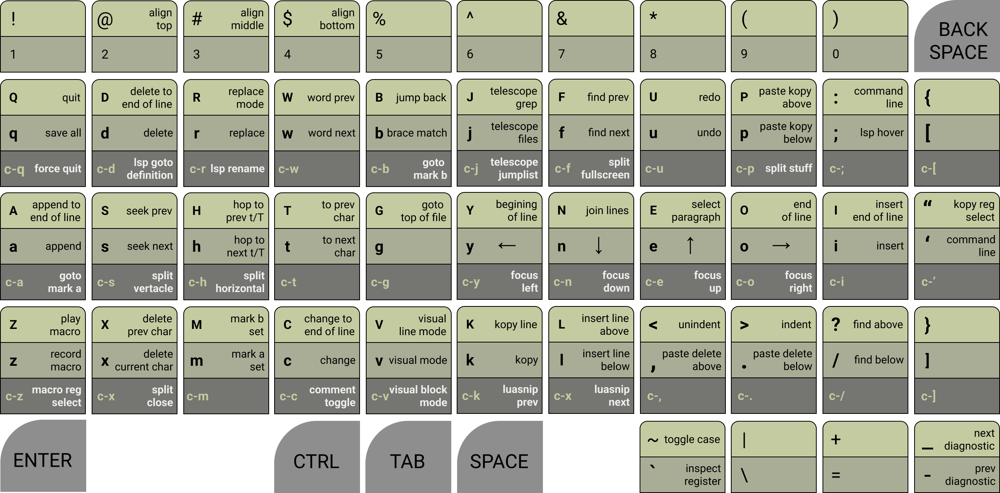

# unruly worker
> a ridiculously fun workman keyboard layout plugin for neovim



## LAYOUT PHILOSOPHY
1. When possible, commands are positioned according to the workman layout heatmap. So frequent use will not strain your hands.
2. When possible, commands are arranged onto a semantic key. This makes it possible for the keymap to be remembered with mnemonic phrases.
3. When possible, keys behavior, or behavior substitute, should stay in the same position as the original-keymap, so that there is no need for experienced vim users to unlearn there years of muscle memory.

## FEATURES
* Navigate vim like normal
* Register Preselection (Yank, Delete, Macro)
* Yank and Delete History
* A nice way to work with macros
* A nice way to work with marks
* A nice way to work with LSP and Diagnostics
* Quickly save and quit
* Quickly navigate jump list
* Quickly step through quicklist, loclist, arg list, buffers
* Easy Spellcheck
* Status bar text generator functions that reveal unruly state
* Easily Opt-Out of specific unruly mappings
* Plugin Support
  * [nvim-cmp](https://github.com/hrsh7th/nvim-cmp) - auto completion
  * [telescope.nvim](https://github.com/nvim-telescope/telescope.nvim) -
    fuzzy search with preview
  * [Comment.nvim](https://github.com/numToStr/Comment.nvim) - comment
    toggling
  * [Navigator.nvim](https://github.com/numToStr/Navigator.nvim) -
    tmux/wez-term navigation
  * [nvim-treesitter](https://github.com/nvim-treesitter/nvim-treesitter) +
    [nvim-treesitter-textobject](https://github.com/nvim-treesitter/nvim-treesitter-textobjects) - syntax navigation
  * [LuaSnip](https://github.com/L3MON4D3/LuaSnip) - powerful snipits

## REGISTER PRESELECTION
With Unruly when you select a register, it stays selected until you change it.
This means you don't select a register for a specific motion, instead you set
the yank or macro register, and then all future yank/paste or record/play
actions will use the selected register until you select a new register. 

## INSTALL AND SETUP
1. Install with your favorite [package manager](https://github.com/folke/lazy.nvim)
2. Add the following **lua** code to your vim config

``` lua
-- Use this setup config if you want to follow the keymap above
local unruly_worker = require('unruly-worker')

-- example setup with default settings
unruly_worker.setup({
  -- you can use the skip_list = {} to stop unruly from creating certain mappings
  -- skip_list = { "z", "Z", "<C-z>"},  skip z related mappings
  skip_list = {},
  booster = {
    quit_easy                   = true,
    scroll_easy                 = true,
    swap_easy                   = true,
    incrament_easy              = true,
    hlsearch_easy               = true,
    lsp_easy                    = true,
    lsp_leader                  = true,
    diagnostic_easy             = true,
    diagnostic_leader           = true,
    -- plugin boosters default to false because they all have dependencies
    plugin_navigator            = false,
    plugin_comment              = false,
    plugin_luasnip              = false,
    plugin_textobject           = false,
    plugin_telescope_leader     = false,
    plugin_telescope_lsp_leader = false,
    plugin_telescope_jump_easy  = false,
    plugin_telescope_paste_easy = false,
    -- the seek booster is "experimental". it seems to work well but the code
    -- feels a lil hacky... I ran into issues in buffer mode when netrw is open and wrote a 
    -- kinda janky hack to get it to behave the way i wanted it to. (🤷 works for me)
    experimental_seek           = false,
  },
})

-- to setup with the defaults you can simply
-- unruly_worker.setup()
```
## [nvim-cmp](https://github.com/hrsh7th/nvim-cmp) MAPPING SETUP
``` lua
local cmp = require("cmp")
local unruly_cmp = require('unruly-worker.external.nvim-cmp')
cmp.setup({
    mapping = unruly_cmp.create_insert_mapping(),
    --  ...
})

cmp.setup.cmdline({ "/", "?" }, {
    mapping = unruly_cmp.create_cmdline_mapping(),
    -- ...
})

cmp.setup.cmdline(":", {
    mapping = unruly_cmp.create_cmdline_mapping(),
    -- ...
})
-- my personal nvim-cmp config file: https://github.com/slugbyte/config/blob/main/conf/config/nvim/lua/slugbyte/plugin/cmp-and-luasnip.lua
```
### `nvim-cmp` insert mode
* `<CR>` - confirm select
* `<C-g> or <Right>` - confirm continue
* `<Tab> or <Down>` - next suggestion
* `<S-Tab> or <Up>` - prev suggestion
* `<C-x>` - abort

### `nvim-cmp` cmdline mode
* `<C-g> or <Right>` - confirm continue
* `<Tab>` - next suggestion
* `<S-Tab>` - prev suggestion
* `<Up>` - prev history
* `<Down>` - next history
* `<CR>` - execute
* `<C-x>` - abort

## [telescope.nvim](https://github.com/nvim-telescope/telescope.nvim) MAPPING SETUP
``` lua
local unruly_telescope = require("unruly-worker.external.telescope")
require("telescope").setup({
    defaults = {
        mappings = unruly_telescope.create_mappings(),
    },
    -- ...
})
-- my personal telescope setup: https://github.com/slugbyte/config/blob/main/conf/config/nvim/lua/slugbyte/plugin/telescope.lua
```
### `telescope.nvim` insert mode
* `<CR>` - select default
* `<C-h>` - select into horizontal split
* `<C-s>` - select into vertical split
* `<Down> or <C-n>` - move selection down
* `<Up> or <C-e>` - move selection up
* `<C-k>` - telescope which key
* `<C-x>` - abort
* `<PageUp>` - scroll preview up
* `<PageDown>` - scroll preview down
* `<Tab>` - toggle selection
* `<C-a>` - select all
* `<C-d>` - deselect all
* `<C-q>` - add selected to quickfix list
* `<C-l>` - add selected to loclist list

### `telescope.nvim` normal mode
> includes everything in insert mode ^
* `e` - move selection up
* `n` - move selection down
* `N` - move to top of selection list
* `E` - move to bottom of selection list
* `<Esc>` - abort


## Unruly Keymap
### Cursor Movement
* `yneo` - are mapped to left, down, up, right
* `Y` - goes to beginning of line
* `O` - goes to end of line
* `gg` - toto top of file
* `GG` - goto end of file
* `t{char}` go to the [count]'th occurance of char to the right
* `T{char}` go to the [count]'th occurance of char to the left
* `h` repeat the last t/T (hop)
* `H` repeat the last t/T reverse (hop reverse)

### Insert text
* `i` - Insert
* `I` - Insert at beginning of line
* `a` - Append
* `a` - Append to end of line
* `l` - insert Line below
* `L` - insert Line above

### Buffer Search
* `/` - search down
* `?` - search up
* `f` - repeat search (find)
* `F` - repeat search reverse (find reverse)

## Command mode
* `:` or `'` command mode

## undo/redo
* `u` undo
* `U` redo

### Window Navigation
* `<ctrl>w` + `yneo` - are mapped to focus pane left, down, up, right
* `<ctrl>` + `yneo` - are mapped to focus pane left, down, up, right
* `<c-x>` close vim split
* `<c-f>` fullscreen vim split
* `<c-s>` split verticle
* `<c-h>` split horizontal

## Kopy and Paste
* Kopy/Paste uses a preselected register. `+` is the default
* Unruly always deletes into register `0`.
* Yank and Delete have separate key maps for pasting
* Yank and Delete use registers 1-9 to track history
* if you want yank and delete to share the same register set the kopy register
  to `0`

### yank and paste from the kopy register
* `k` - yank (kopy)
* `K` - yank line (kopy line)
* `p` - Paste yank below
* `P` - Paste yank above
* `"` - select Kopy register, `[a-z][A-X] and 0 +`
  * press `<enter>` or `<space>` reset to `+`

#### delete and paste from register 0
* `d` delete
* `dd` delete line
* `D` delete to end of line
* `x` delete under cursor
* `X` delete before cursor
* `c` delete then enter insert mode
* `cc` delete line then enter insert mode
* `C` delete to end of line then enter insert mode
* `.` paste delete below
* `,` paste delete above

## Macro
Macros use preselected registers, similar to kopy/paste. By default the macro register
is `'z'`.

* `z` record a macro into the preselected register (default: `'z'`)
* `Z` play a macro from the preselected register
* `<C-z>` select the macro register
* `<leader>zl` toggle macro recording lock
  * this is useful if you want to make sure you don't accidentally overwrite
  the current macro register
*  `<leader>zp` pretty print the contents of the macro register
It will display special keys like `<enter>`, `<esc>` or `<c-q>`

Regsiters [0-9] are reserved for the delete register and yank history. [(See Kopy Below)](#Kopy)

## MARKS
The unruly idea behind marks is that you only need two marks, for everything
else just use [telescope](https://github.com/nvim-telescope/telescope.nvim). Unruly marks can be in local buffer mode or global
mode. When in local mode unruly uses marks `a` and `b` to hop within a buffer.
When in global mode unruly uses marks `A` and `B` to hop to marks in any buffer.

* `<leader>a` set mark a
* `<leader>b` set mark b
* `<C-a>` goto mark a
* `<C-b>` goto mark b
* `m` toggle between local and global mark mode
* `M` clear current mark mode marks

## Seek Lists (next, prev, first, last)
Unruly allows you to quickly navigate through currently the quickfix list,
loclist, arg list, and currently open buffers. Seek keymaps only target one
type of list at a time, by default seek target mode will be open buffers.

* `<leader>sr` seek target  mode rotate (buffer, quickfix, loclist, arg list)
* `<leader>sl` goto first item in seek list
* `<leader>sf` goto last item in seek list
* `<leader>n` goto next seek item
* `<leader>p` goto prev seek item

## Boosters
> idk why i called them boosters, they are really just things I thought people
> might want to opt out of.

#### quit_easy
* if disabled
  * `q` anq `Q` will have no behavior `noOP`
* if **enabled**
  * `q` write all buffers (`:wall`)
  * `Q` quit all (`:qall`)
  * `<C-q>` force quit all (`:qall!`)

#### swap_easy
* `<C-Up>` swap line/lines up
* `<C-Down>` swap line/lines down

#### scroll_easy
* `<PageUp>` scroll up
* `<Home>` scroll up fast
* `<PageDown>` scroll down
* `<End>` scroll down fast

#### hlsearch_easy
> NOTE: for this to work hlsearch needs to be enabled `vim.opt.hlsearch = true`
* `<Esc>` will disable current hlsearch

#### diagnostic_easy
* `-` prev diagnostic
* `_` next diagnostic

#### diagnostic_leader
* `<leader>dp` prev diagnostic
* `<leader>dn` next diagnostic

#### lsp_easy
* `<C-d>` lsp goto definition
* `<C-r>` lsp rename
* `;` lsp hover
* `=` lsp code action

#### lsp_leader
* `<leader>la` lsp code action
* `<leader>lh` lsp hover
* `<leader>ld` lsp goto definition
* `<leader>lD` lsp goto Declaration
* `<leader>lf` lsp format
* `<leader>lr` lsp rename

#### plugin_telescope_lsp_leader
> this booster depends on [telescope.nvim](https://github.com/nvim-telescope/telescope.nvim/tree/master)
* `<leader>l?` telescope lsp diagnostics
* `<leader>lc` telescope lsp incoming calls
* `<leader>lC` telescope lsp outgoing calls
* `<leader>li` telescope lsp goto implementaion
* `<leader>lR` telescope lsp references
* `<leader>ls` telescope lsp domument symbols
* `<leader>lS` telescope lsp workspace symbols
* `<leader>l$` telescope lsp dynamic workspacen symbols
* `<leader>lt` telescope lsp types

#### plugin_telescope_jump_easy
> this booster depends on [telescope.nvim](https://github.com/nvim-telescope/telescope.nvim/tree/master)
* if disabled
  * `j` and `J` will have no behavior (`noOP`)
* if **enabled**
  * `j` telescope find files (jump)
  * `J` telescope live grep (grep jump)
  * `<C-j>` telescope jumplist (jumplist jump)

#### `plugin_telescope_paste_easy = true`
* `<c-p>` telescope paste from any register

#### `plugin_telescope_leader = true`
> this booster depends on [telescope.nvim](https://github.com/nvim-telescope/telescope.nvim/tree/master)
* `<leader>/` telescope fuzzy find in current buffer
* `<leader>tb` telescope buffers
* `<leader>to` telescope old files (recent files)
* `<leader>tq` telescope quickfix
* `<leader>tl` telescope loclist
* `<leader>tj` telescope jumplist
* `<leader>tm` telescope man pages
* `<leader>th` telescope help tags
* `<leader>tt` telescope tags
* `<leader>tc` telescope keymaps
* `<leader>tp` telescope paste from any register
* `<leader>tr` telescope repeat last search

#### `plugin_comment = true`
> this booster depends on any plugin that uses `gc` and `gcc` mappings to comment toggle, like
> [Comment.nvim](https://github.com/numToStr/Comment.nvim)
* `<c-c>` toggle comment

#### `plugin_navigator = true`
> this booster depends on [Navigator.nvim](https://github.com/numToStr/Navigator.nvim)
* `<c-y>` focus left (vim or terminal multiplexer)
* `<c-n>` focus down (vim or terminal multiplexer)
* `<c-e>` focus up (vim or terminal multiplexer)
* `<c-o>` focus right (vim or terminal multiplexer)

#### `plugin_textobject = true`
> this booster depends on [nvim-treesitter](https://github.com/nvim-treesitter/nvim-treesitter) and
    [nvim-treesitter-textobject](https://github.com/nvim-treesitter/nvim-treesitter-textobjects)
* if disabled
  * `s` substitute
  * `S` substitute line
* if **enabled**
  * `s` next text object
  * `S` prev text object

#### `plugin_luasnip = true`
> this booster depends on [LuaSnip](https://github.com/L3MON4D3/LuaSnip) powerful snipits
* `<C-k> or <C-Left>` luasnip jump prev
* `<C-l> or <C-Right>` luasnip jump next

## ABOUT
Being dyslexic has taught me its often easier for me to build a system for
myself than it is to learn a system that works well for everyone else. This
usually isn't my first approach when trying to learn something new, but when
the struggle is real, I inevitably decide its time to reinvent the wheel. I
think the creation of this keymap is a good example of how my learning style tends to unfold in my life.

After using vim as my only editor for more than 7 years I continued to have
trouble remembering commands. I was proficient enough for my needs, but my
skills plateaued far short of where I wanted them to be. I tried to improve using numerous different tips I found online, but I never quite felt happy with my progress.

Unrelated to vim, I decided to learn the [workman layout](https://workmanlayout.org/).
This decision forced me to consider how to remap a few keys, but one thing lead
to another and eventually I had created an entirely new layout, the
unruly-worker layout. The process of creating this keymap lead to me spending about
a year reading `:help` and scouring the internet for vim config gems. Which
probably seems ridiculous for many people, but for me its just how I've had to
do most things in life. The time feels well used, because I spent the last decade
writing code and I don't plan to stop for many decades to come. Now I've been using
this layout for more than A year at the time of writing this plugin. Unlike
my first 7 years with vim, I can now remember the keymap well enough to experience the
sensation of manipulating the text without noticing that my hands, or
keyboard keys, or even that vim itself has anything to do with it. For me vim
was always the right tool for the job, unruly-worker is just a
[jig](https://en.wikipedia.org/wiki/Jig_%28tool%29) that makes the tool fit perfectly into my workflow.

Dyslexia may or may not have been what made it so hard for me to learn vim, but
it has normalized the process of reinventing wheels to learn for me. The
unruly-worker layout, is a classic example of the type of outcomes that my
somewhat accidental process produces. A tool that may not be useful for anyone
else, but makes a tool that is useful to many other people accessible to me.

## HELP WANTED
Suggestions, Critique, and Spellcheck are always appreciated :)

See the [Contributing Guite](./CONTRIBUTING.md)

## SELF-PROMO
If you like this project star the GitHub repository :)

## TODO
* create a `:UnrulySchool` command that has an interactive tutorial

## LICENSE
[Unlicense](https://unlicense.org/)
