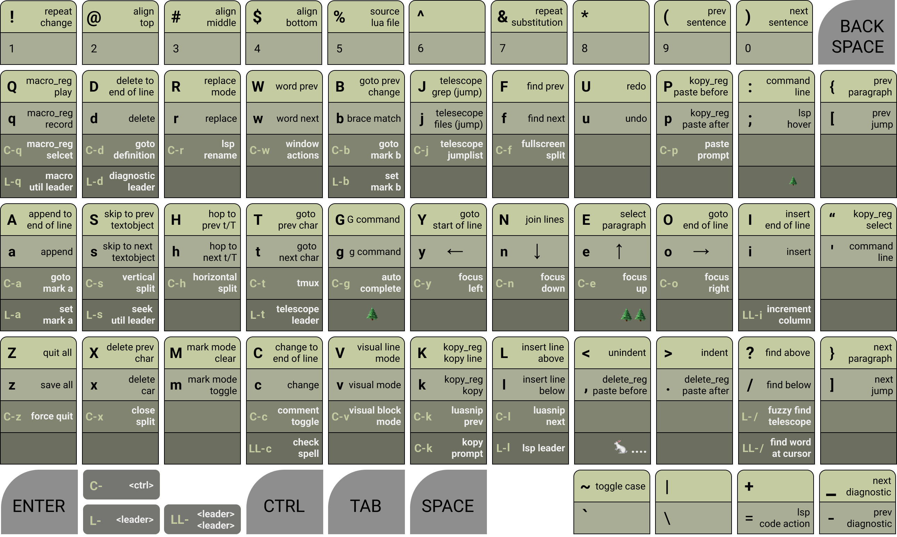

# unruly worker
> a ridiculously fun alternative neovim keymap for the workman keyboard layout

## default setup


## everything enabled



## LAYOUT PHILOSOPHY
1. When possible, commands are positioned according to the workman layout heatmap. So frequent use will not strain your hands.
2. When possible, commands are arranged onto a semantic key. This makes it possible for the keymap to be remembered with mnemonic phrases.
3. When possible, keys behavior, or behavior substitute, should stay in the same position as the original-keymap, so that there is no need for experienced vim users to unlearn there years of muscle memory.

## FEATURES
* default features
  * Easily Opt-Out of specific unruly mappings
  * Navigate vim like normal using `yneo`
  * Close to vanilla vim motion experience 
  * A nice way to navigate the jumplist
  * A healthcheck to ensure your setup is correct
* basic opt-in features
  * A nice way to trigger LSPs behavior
  * A nice way to navigate diagnostics
  * A nice way to focus and manipulate splits
  * A nice way to work with hlsearch
  * A nice way to swap lines
  * A nice way to spellcheck
  * A nice way to create an incrementing column of numbers
  * A nice way to source lua/vim files
  * A companion unruly workman keyboard layout tmux config
* unruly opt-in features
  * Yank, Delete, and Macros use register preselection
  * Yank and Delete have history
  * Keys to lock macro recording and pretty print the macro register
  * Easily paste edit and load macros
  * A nice way to step through the quickfix list, loclist, and buffers
  * A blazingly fast way to save and quit
  * A blazingly fast way to work with marks
  * A status bar text generator that creates a [HUD](https://en.wikipedia.org/wiki/Head-up_display) for unruly-worker's state
* plugin support opt-in features
  * Workman keyboard layout for [nvim-cmp](https://github.com/hrsh7th/nvim-cmp) auto completion
  * Workman keyboard layout for [telescope.nvim](https://github.com/nvim-telescope/telescope.nvim) fuzzy search with preview
  * Workman keyboard layout for [Comment.nvim](https://github.com/numToStr/Comment.nvim) comment toggling
    toggling
  * Workman keyboard layout for [Navigator.nvim](https://github.com/numToStr/Navigator.nvim) to navigate tmux or wez-term
  * Workman keyboard layout for [LuaSnip](https://github.com/L3MON4D3/LuaSnip) to navigate snipits
  * Workman keyboard layout for [nvim-treesitter](https://github.com/nvim-treesitter/nvim-treesitter) with
    [nvim-treesitter-textobject](https://github.com/nvim-treesitter/nvim-treesitter-textobjects) for syntax navigation

#### REGISTER PRESELECTION?
With `unruly_kopy` and `unruly_macro` when you select a register, it stays selected until you change it.
This means you don't select a register for a specific motion, instead you set
the yank or macro register, and then all future yank/paste or record/play
actions will use the selected register until you select a new register.

## INSTALL AND SETUP
1. Install with your favorite neovim [package manager](https://github.com/folke/lazy.nvim)
2. Add the following **lua** code to your vim config

``` lua
-- Use this setup config if you want to follow the keymap above
local unruly_worker = require('unruly-worker')

-- to setup with the defaults you can simply put
-- unruly_worker.setup()

-- example setup with the default settings
unruly_worker.setup({
  -- you can use the skip_list = {} to stop unruly from creating certain mappings
  -- skip_list = { "z", "Z", "<C-z>"},  skip z related mappings
  skip_list = {},
  unruly_options = {
    -- set default unruly kopy register must be [a-z] [A-Z] 0 +
    kopy_reg = "+",
    -- set default unruly macro register must be [a-z] [A-Z]
    macro_reg = "q",
    -- set default unruly seek mode, must be unruly_worker.seek_mode.(buffer|loclist|quickfix)
    seek_mode = unruly_worker.seek_mode.buffer,
    -- set unruly mark mode to global or local
    mark_mode_is_global = false
  },
  -- boosters allow you to op-in to extra keymaps
  -- or opt-out of the default keymaps if you want that for some reason
  booster = {
    default                     = true,
    -- easy stuff are just additional opt in keymaps
    easy_swap                   = false,
    easy_search = false,
    easy_line                   = false,
    easy_spellcheck             = false,
    easy_incrament              = false,
    easy_hlsearch               = false,
    easy_focus                  = false,
    easy_window                 = false,
    easy_jumplist               = false,
    easy_scroll                 = false,
    easy_source                 = false,
    easy_lsp                    = false,
    easy_lsp_leader             = false,
    easy_diagnostic             = false,
    easy_diagnostic_leader      = false,
    -- unruly stuff change neovim's normal behavior
    unruly_seek                 = false,
    unruly_mark                 = false,
    unruly_macro                = false,
    unruly_kopy                 = false,
    unruly_quit                 = false,
    -- plugin stuff have external dependencies
    plugin_navigator            = false,
    plugin_comment              = false,
    plugin_luasnip              = false,
    plugin_textobject           = false,
    plugin_telescope_leader     = false,
    plugin_telescope_lsp_leader = false,
    plugin_telescope_easy_jump  = false,
    plugin_telescope_easy_paste = false,
    plugin_telescope_diagnostic_leader = false,
  },
})
```

## [nvim-cmp](https://github.com/hrsh7th/nvim-cmp) MAPPING SETUP (optional)
``` lua
-- NOTE: its recommended that you require cmp before unruly_worker.external.nvim-cmp
local cmp = require("cmp")
local unruly_cmp = require('unruly-worker.external.nvim-cmp')
cmp.setup({
    mapping = unruly_cmp.create_insert_mapping(),
    -- optionally you can pass a config with a skip_list and mappings
    -- mapping = unruly_cmp.create_insert_mapping({
      -- skip_list = { "<Right>" }, -- opt out of the <Right> keymap
      -- you can add your own mappings here
      -- your mappings will allways overwrite the unruly_cmp default mappings
      -- mapping = {
      --   ["<C-u>"] = cmp.mapping.complete() -- use <c-u> to complete
      -- },
    -- }),
    -- rest of config...
})

cmp.setup.cmdline({ "/", "?" }, {
    -- you can also pass the optional config into create_cmdline_mapping
    mapping = unruly_cmp.create_cmdline_mapping(),
    -- rest of config...
})

cmp.setup.cmdline(":", {
    mapping = unruly_cmp.create_cmdline_mapping(),
    -- rest of config...
})
-- my personal nvim-cmp config file: https://github.com/slugbyte/config/blob/main/conf/config/nvim/lua/slugbyte/plugin/cmp-and-luasnip.lua
```
### `nvim-cmp` insert mode
* `<CR>` - confirm select
* `<C-g> or <Right>` - confirm continue
* `<Tab> or <Down>` - next suggestion
* `<S-Tab> or <Up>` - prev suggestion
* `<C-x>` - abort

### `nvim-cmp` cmdline mode
* `<C-g> or <Right>` - confirm continue
* `<Tab>` - next suggestion
* `<S-Tab>` - prev suggestion
* `<Up>` - prev history
* `<Down>` - next history
* `<CR>` - execute
* `<C-x>` - abort

## [telescope.nvim](https://github.com/nvim-telescope/telescope.nvim) MAPPING SETUP (optional)
``` lua
-- NOTE: its recommended that you require telescope before unruly_worker.external.telescope
local telescope = require("telescope")
local telescope_action = require("telescope.action")
local unruly_telescope = require("unruly-worker.external.telescope")
telescope.setup({
    defaults = {
        mappings = unruly_telescope.create_mappings(),
        -- -- optionally you can pass a config with skip_list, insert_mapping, and normal_mapping
        -- mappings = unruly_telescope.create_mappings({
        --   skip_list = {"<Tab>"}, -- disable <tab> map
        --   -- insert_mapping will overwrite any default unruly_telescope insert mappings
        --   insert_mapping = {
        --     "<c-u>" = telescope_action.select_default(), -- <c-u> select default
        --   },
        --   -- normal_mapping will overwrite any default unruly_telescope normal mappings
        --   normal_mapping = {
        --     "<c-u>" = telescope_action.select_default(), -- <c-u> select default
        --   },
        -- }),
    },
    -- rest of config...
})
-- my personal telescope setup: https://github.com/slugbyte/config/blob/main/conf/config/nvim/lua/slugbyte/plugin/telescope.lua
```
### `telescope.nvim` insert mode
* `<CR>` - select default
* `<C-h>` - select into horizontal split
* `<C-s>` - select into vertical split
* `<Down> or <C-n>` - move selection down
* `<Up> or <C-e>` - move selection up
* `<C-k>` - telescope which key
* `<C-x>` - abort
* `<PageUp>` - scroll preview up
* `<PageDown>` - scroll preview down
* `<Tab>` - toggle selection
* `<C-a>` - select all
* `<C-d>` - deselect all
* `<C-q>` - add selected to quickfix list
* `<C-l>` - add selected to loclist list

### `telescope.nvim` normal mode (optional)
> includes everything in insert mode ^
* `e` - move selection up
* `n` - move selection down
* `N` - move to top of selection list
* `E` - move to bottom of selection list
* `<Esc>` - abort

##  [nvim-treesitter-textobject](https://github.com/nvim-treesitter/nvim-treesitter-textobjects) MAPPING SETUP
```lua 
local unruly_textobjects = require("unruly-worker.external.textobjects")
require("nvim-treesitter.configs").setup({
    textobjects = {
        select = {
            keymaps = unruly_textobjects.select_keymaps,
            -- rest of config...
        },
        move = {
            goto_next_start = unruly_textobjects.move_goto_next_start,
            goto_previous_start = unruly_textobjects.move_goto_previous_start,
            goto_next_end = unruly_textobjects.move_goto_next_end,
            goto_previous_end = unruly_textobjects.move_goto_previous_end,
            -- rest of config...
        },
    },
})
```

#### textobjects select and movement
* `go{object}` goto next outer object
* `gi{object}` goto next inner object
* `ge{object}` goto prev end object
* `Go{object}` goto prev outer object
* `Gi{object}` goto prev inner object
* `Ge{object}` goto prev end object
* `vo{object}` visual outer object
* `vi{object}` visual inner object
* `do{object}` delete outer object
* `di{object}` delete inner object
* `{object}`
  * `a` assigment
  * `b` block
  * `c` call
  * `d` comment (doc)
  * `f` function
  * `i` conditional (if)
  * `l` loop
  * `p` parameter
  * `r` return
  * `s` struct or class

## UNRULY TMUX CONFIG SETUP (optional)
This project includes a tmux config file with tmux unruly-worker style keybindings,
[See the unruly tmux README](./tmux/) for installation instructions and overview.

## UNRULY KEYMAP OVERVIEW (default booster)
### cursor movement
* `yneo` _______ are mapped to left, down, up, right
* `Y` __________ goes to beginning of line
* `O` __________ goes to end of line
* `w` __________ next word
* `W` __________ prev word
* `b` __________ jump to matching brace
* `B` __________ jump cursor to the last place a change was made (back change)
* `gg` _________ toto top of file
* `GG` _________ goto end of file
* `t{char}` ____ go to the [count]'th occurance of char to the right
* `T{char}` ____ go to the [count]'th occurance of char to the left
* `h` __________ repeat the last t/T (hop)
* `H` __________ repeat the last t/T reverse (hop reverse)
* `(` __________ prev sentence
* `)` __________ next sentence
* `{` __________ prev paragraph
* `}` __________ next paragraph

### insert text
* `i` __________ Insert
* `I` __________ Insert at beginning of line
* `a` __________ Append
* `a` __________ Append to end of line
* `r` __________ replace
* `R` __________ replace mode
* `l` __________ insert Line below
* `L` __________ insert Line above

#### kopy
* `k` __________ kopy (yank)
* `K` __________ kopy line (yank line)

#### paste
* `p` __________ paste
* `P` __________ paste line

#### delete
* `d` __________ delete
* `D` __________ delete to end of line
* `dd` _________ delete lines
* `x` __________ delete under cursor
* `X` __________ delete before cursor

#### change
* `c` __________ change
* `C` __________ change to end of line
* `cc` _________ change line
* `s` __________ substitute
* `S` __________ substitute line

### macros
* `q{reg}` _____ record a macro
* `Q{reg}` _____ play a macro

### marks and jumplist
* `m{mark}` ____ goto a mark
* `M{mark}` ____ set a mark
* `[` __________ goto previous jumplist location
* `]` __________ goto next jumplist location

### visual mode
* `v` __________ visual mode
* `V` __________ visual line mode
* `<c-v>` ______ visual block mode
* `E` __________ select paragraph (envelope paragraph `vip`)

### search
* `/` __________ search down
* `?` __________ search up
* `f` __________ repeat search (find)
* `F` __________ repeat search reverse (find reverse)

### utility
* `:` or `'` ___ command mode
* `~` __________ toggle case
* `"` __________ select register
* `!` __________ repeat change `(repeat a vim motion)`
* `&` __________ repeat substitute `(repeat a :s/thing/new)`
* `u` __________ undo
* `U` __________ redo
* `<<` _________ shift indent left
* `>>` _________ shift indent right
* `g` __________ g command
* `G` __________ G command
* `z` __________ z command
* `Z` __________ Z command
* command mode
  * `<c-a>` ____ goto beginning of line
  * `<c-e>` ____ goto end of line
  * `<c-u>` ____ delete to beginning of line

### current line alignment
* `@` __________ align top
* `$` __________ align middle
* `#` __________ align bottom

### window navigation
* `<ctrl>wy` ___ focus left
* `<ctrl>wn` ___ focus down
* `<ctrl>we` ___ focus up
* `<ctrl>wo` ___ focus right
* `<ctrl>wx` ___ close
* `<ctrl>wf` ___ fullscreen current split
* `<ctrl>wh` ___ horizontal split
* `<ctrl>ws` ___ vertical split
* `<ctrl>ws` ___ vertical split

### keys with no behavior
`j` `J` `%` `^` `=` `*` `-` `_` `+` `,` `.` `|` `;`

## EASY BOOSTERS (disabled by default)
> easy boosters don't dramatically alter anything, they are just additional
> keymaps that I didn't include in the basic setup, in order to keep it as
> vanilla as possible.

#### easy_swap
* `<C-Up>` ___________ swap line/lines up
* `<C-Down>` _________ swap line/lines down

#### easy_focus
* `<c-y>` ____________ focus left (vim)
* `<c-n>` ____________ focus down (vim)
* `<c-e>` ____________ focus up (vim)
* `<c-o>` ____________ focus right (vim)

#### easy_window
* `<c-x>` ____________ close vim split
* `<c-f>` ____________ fullscreen current split
* `<c-s>` ____________ split verticle
* `<c-h>` ____________ split horizontal

#### easy_hlsearch
> NOTE: this will auto enable the vim `hlsearch` option
* `<Esc>` ____________ will disable the current hlsearch highlighting

#### easy_source
> NOTE: this will disable the builtin `matchit` plugin
* `%` save and source the current lua or vimscript file

#### easy_scroll
* `<PageUp>` _________ scroll up
* `<Home>` ___________ scroll up fast
* `<PageDown>` _______ scroll down
* `<End>` ____________ scroll down fast

#### easy_jumplist
* `<c-j>` show the jumplist

#### easy_diagnostic
* `-` _______________ prev diagnostic
* `_` _______________ next diagnostic

#### easy_diagnostic_leader
* `<leader>dp` ______ prev diagnostic
* `<leader>dn` ______ next diagnostic

#### easy_lsp
* `<C-d>`  __________ lsp goto definition
* `<C-r>`  __________ lsp rename
* `;`  ______________ lsp hover
* `=`  ______________ lsp code action

#### easy_lsp_leader
* `<leader>la` ______ lsp code action
* `<leader>lh` ______ lsp hover
* `<leader>ld` ______ lsp goto definition
* `<leader>lD` ______ lsp goto Declaration
* `<leader>lf` ______ lsp format
* `<leader>lr` ______ lsp rename

#### easy_spellcheck
* `<leader><leader>c` ________ check spelling suggestions for word

#### easy_line
* `<leader><leader>l` ________ add blank line blow (stay in normal mode)
* `<leader><leader>L` ________ add blank line above (stay in normal mode)

#### easy_search
* `<leader><leader>/` ________ find word under cursor
* `<leader><leader>?` ________ find word under cursor reverse

#### easy_incrament
* `<leader><leader>i` ________ create a column of incrementing numbers

```
# select the colomn of 0s and then <leader><leader>i
0 -(will become)-> 1
0 -(will become)-> 2
0 -(will become)-> 3
0 -(will become)-> 4
0 -(will become)-> 5
```

## UNRULY BOOSTERS (disabled by default)
> unruly boosters change the way that neovim typically works, they are probably
> not most vim users cup of tea

### unruly_kopy
* kopy and paste use the preselected register `kopy_reg` (default: `+`)
* delete, change, substitute, and paste always use register `0`
* kopy, delete, change, and substitute share registers 1-9 to track history

#### kopy and paste with the kopy_reg
* `k` ______________ kopy (yank)
* `K` ______________ kopy line (yank line)
* `p` ______________ paste kopy below
* `P` ______________ paste kopy above
* `"` ______________ will prompt you to select a new `kopy_register`
  * valid registers are: `[a-z][A-X] and 0 +`
  * you can press `<enter>` or `<space>` reset to the default `+` register

#### kopy prompt
> the kopy prompt does not limit register selection or track history
* `<C-k>` __________ prompt to kopy selected text into any register
* `<C-p>` __________ prompt to paste from any register

#### delete, change, substitute, and paste from register 0
* `d` ______________ delete
* `dd` _____________ delete line
* `D` ______________ delete to end of line
* `s` ______________ substitute 
* `S` ______________ substitute line
* `x` ______________ delete under cursor
* `X` ______________ delete before cursor
* `c` ______________ delete then enter insert mode
* `cc` _____________ delete line then enter insert mode
* `C` ______________ delete to end of line then enter insert mode
* `.` ______________ paste register 0 below
* `,` ______________ paste register 0 above

### unruly_mark
The unruly idea behind marks is that you only need two marks, for everything
else just use [telescope](https://github.com/nvim-telescope/telescope.nvim). Unruly marks can be in local buffer mode or global
mode, by default it will be in local mode.
* `<leader>a` _____ set mark a
* `<leader>b` _____ set mark b
* `<C-a>` _________ goto mark a
* `<C-b>` _________ goto mark b
* `m` _____________ toggle between local and global mark mode
* `M` _____________ clear current mark mode marks

### unruly_seek
unruly seek allows you to quickly navigate through quickfix list,
loclist, and currently open buffers. Seek keymaps only target one
type of seekable list at a time, by default the seek type will be buffers.

* `<leader>sn` _____ goto next seek item
* `<leader>sp`  ____ goto prev seek item
* `<leader>ss` ____ goto first item in seek list (start)
* `<leader>se` ____ goto last item in seek list (end)
* `<leader>sq` ____ seek the quickfix list
* `<leader>sl` ____ seek the loclist
* `<leader>sb` ____ seek open buffers

### unruly_macro
unruly macros use the preselected register `macro_reg` (default: `z`)

* `q` ______________ record macro
* `Q` ______________ play macro
* `<C-q>` __________ select the macro register
  * valid registers: `[a-z][A-Z]`
* `<leader>qv` _____ pretty print the current macro content (view)
* `<leader>qp` _____ pretty paste the current macro content into the current buffer
* `<leader>qi` _____ import select text as a macro
  * this will convert special keys in the selected text like `<cr>` `<esc>` into the register correctly
* `<leader>ql` _____ toggle macro recording/import lock
  * this is useful if you want to make sure you don't accidentally overwrite the current macro register

### unruly_quit
> this is maby a bad idea, but I love it
* `z` _____________ write all buffers, and print a random emoticon (`:wall`)
  * the random emoticon is useful as visual feedback that the write occurred `(づ ◕‿◕ )づ`
* `Z` _____________ write the current buffer
* `<C-z>` _________ prompt to quit (`y` for yes, `f` for force quit)

## PLUGIN BOOSTERS (disabled by default)
> plugin boosters have other plugin dependencies

#### plugin_telescope_jump_easy
> depends on [telescope.nvim](https://github.com/nvim-telescope/telescope.nvim/tree/master)
* `j` telescope find files (jump)
* `J` telescope live grep (grep jump)
* `<C-j>` telescope jumplist (jumplist jump)

#### plugin_telescope_leader
> depends on [telescope.nvim](https://github.com/nvim-telescope/telescope.nvim/tree/master)
* `<leader>/` telescope fuzzy find in current buffer
* `<leader>tf` telescope files
* `<leader>tg` telescope grep
* `<leader>tb` telescope buffers
* `<leader>to` telescope old files (recent files)
* `<leader>tq` telescope quickfix
* `<leader>tl` telescope loclist
* `<leader>tj` telescope jumplist
* `<leader>tm` telescope man pages
* `<leader>th` telescope help tags
* `<leader>tt` telescope tags
* `<leader>tc` telescope keymaps
* `<leader>tp` telescope paste from any register
* `<leader>tr` telescope repeat last search

#### plugin_telescope_lsp_leader
> depends on [telescope.nvim](https://github.com/nvim-telescope/telescope.nvim/tree/master)
* `<leader>lc` telescope lsp incoming calls
* `<leader>lC` telescope lsp outgoing calls
* `<leader>li` telescope lsp goto implementation
* `<leader>lr` telescope lsp references
* `<leader>ls` telescope lsp document symbols
* `<leader>lS` telescope lsp workspace symbols
* `<leader>l$` telescope lsp dynamic workspace symbols
* `<leader>lt` telescope lsp types

#### plugin_telescope_diagnostic_leader
> depends on [telescope.nvim](https://github.com/nvim-telescope/telescope.nvim/tree/master)
* `<leader>d?` telescope lsp diagnostics

#### plugin_comment
> depends on any plugin that uses `gc` and `gcc` mappings to comment toggle, like
> [Comment.nvim](https://github.com/numToStr/Comment.nvim)
* `<c-c>` toggle comment

#### plugin_navigator
> depends on [Navigator.nvim](https://github.com/numToStr/Navigator.nvim)
* `<c-y>` focus left (vim or terminal multiplexer)
* `<c-n>` focus down (vim or terminal multiplexer)
* `<c-e>` focus up (vim or terminal multiplexer)
* `<c-o>` focus right (vim or terminal multiplexer)

#### plugin_textobject
> depends on [nvim-treesitter](https://github.com/nvim-treesitter/nvim-treesitter) and
    [nvim-treesitter-textobject](https://github.com/nvim-treesitter/nvim-treesitter-textobjects)

`plugin_textobject` will whatever `s` and `S` where previously (for example
unruly_kopy's `s`)
* `s` skip to next textobject
* `S` skip to prev textobject

#### plugin_luasnip
> depends on [LuaSnip](https://github.com/L3MON4D3/LuaSnip) powerful snipits
* `<C-k> or <C-Left>` luasnip jump prev
* `<C-l> or <C-Right>` luasnip jump next

## ABOUT
Being dyslexic has taught me its often easier for me to build a system for
myself than it is to learn a system that works well for everyone else. This
usually isn't my first approach when trying to learn something new, but when
the struggle is real, I inevitably decide its time to reinvent the wheel. I
think the creation of this keymap is a good example of how my learning style tends to unfold in my life.

After using vim as my only editor for more than 7 years I continued to have
trouble remembering commands. I was proficient enough for my needs, but my
skills plateaued far short of where I wanted them to be. I tried to improve using numerous different tips I found online, but I never quite felt happy with my progress.

Unrelated to vim, I decided to learn the [workman layout](https://workmanlayout.org/).
This decision forced me to consider how to remap a few keys, but one thing lead
to another and eventually I had created an entirely new layout, the
unruly-worker layout. The process of creating this keymap lead to me spending about
a year reading `:help` and scouring the internet for vim config gems. Which
probably seems ridiculous for many people, but for me its just how I've had to
do most things in life. The time feels well used, because I spent the last decade
writing code and I don't plan to stop for many decades to come. Now I've been using
this layout for more than A year at the time of writing this plugin. Unlike
my first 7 years with vim, I can now remember the keymap well enough to experience the
sensation of manipulating the text without noticing that my hands, or
keyboard keys, or even that vim itself has anything to do with it. For me vim
was always the right tool for the job, unruly-worker is just a
[jig](https://en.wikipedia.org/wiki/Jig_%28tool%29) that makes the tool fit perfectly into my workflow.

Dyslexia may or may not have been what made it so hard for me to learn vim, but
it has normalized the process of reinventing wheels to learn for me. The
unruly-worker layout, is a classic example of the type of outcomes that my
somewhat accidental process produces. A tool that may not be useful for anyone
else, but makes a tool that is useful to many other people accessible to me.

## HELP WANTED
Suggestions and Spellcheck are always appreciated :)

See the [Contributing Guite](./CONTRIBUTING.md)

## SELF-PROMO
If you like this project star the GitHub repository :)

## LICENSE
[Unlicense](https://unlicense.org/)
