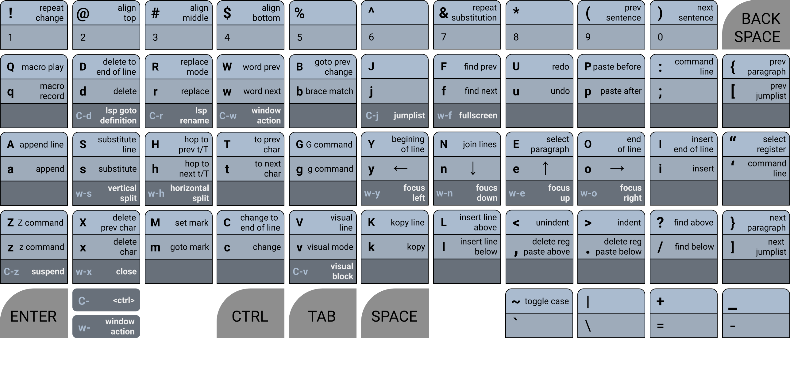
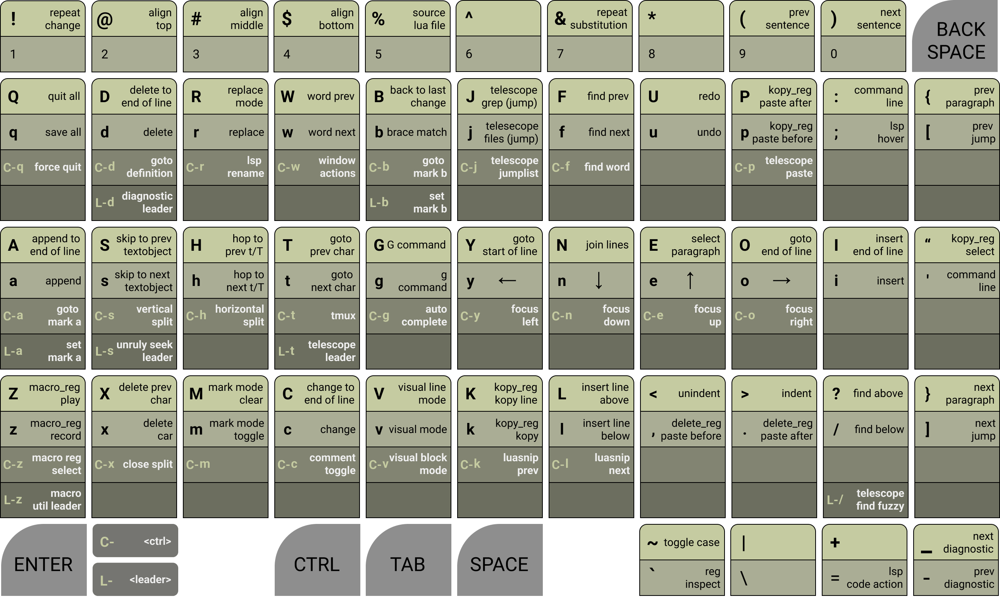

# unruly worker
> a ridiculously fun alternative neovim keymap and tmux setup for the workman keyboard layout

## default setup


## everything enabled


## LAYOUT PHILOSOPHY
1. When possible, commands are positioned according to the workman layout heatmap. So frequent use will not strain your hands.
2. When possible, commands are arranged onto a semantic key. This makes it possible for the keymap to be remembered with mnemonic phrases.
3. When possible, keys behavior, or behavior substitute, should stay in the same position as the original-keymap, so that there is no need for experienced vim users to unlearn there years of muscle memory.

## FEATURES
* default features
  * Easily Opt-Out of specific unruly mappings
  * Navigate vim like normal using `yneo`
  * Vim motions are similar to original
  * Close to vanilla experience
* basic opt-in features
  * A nice way to work with LSPs
  * A nice way to navigate diagnostics
  * A nice way to spellcheck
  * A nice way to swap lines
  * A nice way to focus and manipulate splits
  * A nice way to create an incrementing column of numbers
  * A workman keyboard tmux config
* unruly opt-in features
  * Yank, Delete, and Macros use register preselection
  * Yank and Delete have history
  * Keys to lock macro recording and pretty print the macro register
  * A nice way to step through the quickfix list, loclist, and buffers
  * A status bar text generator that creates a [HUD](https://en.wikipedia.org/wiki/Head-up_display) for unruly-worker's state
  * A nice way to work with marks and navigate the jumplist
* plugin support opt-in features
  * Workman keyboard layout for [nvim-cmp](https://github.com/hrsh7th/nvim-cmp) auto completion
  * Workman keyboard layout for [telescope.nvim](https://github.com/nvim-telescope/telescope.nvim) fuzzy search with preview
  * Workman keyboard layout for [Comment.nvim](https://github.com/numToStr/Comment.nvim) comment toggling
    toggling
  * Workman keyboard layout for [Navigator.nvim](https://github.com/numToStr/Navigator.nvim) to navigate tmux or wez-term
  * Workman keyboard layout for [LuaSnip](https://github.com/L3MON4D3/LuaSnip) to navigate snipits
  * Workman keyboard layout for [nvim-treesitter](https://github.com/nvim-treesitter/nvim-treesitter) with
    [nvim-treesitter-textobject](https://github.com/nvim-treesitter/nvim-treesitter-textobjects) for syntax navigation

#### REGISTER PRESELECTION?
With `unruly_kopy` and `unruly_macro` when you select a register, it stays selected until you change it.
This means you don't select a register for a specific motion, instead you set
the yank or macro register, and then all future yank/paste or record/play
actions will use the selected register until you select a new register.

## INSTALL AND SETUP
1. Install with your favorite neovim [package manager](https://github.com/folke/lazy.nvim)
2. Add the following **lua** code to your vim config

``` lua
-- Use this setup config if you want to follow the keymap above
local unruly_worker = require('unruly-worker')

-- example setup with default settings
unruly_worker.setup({
  -- you can use the skip_list = {} to stop unruly from creating certain mappings
  -- skip_list = { "z", "Z", "<C-z>"},  skip z related mappings
  skip_list = {},
  booster = {
  },
})

-- to setup with the defaults you can simply put
-- unruly_worker.setup()
```

## [nvim-cmp](https://github.com/hrsh7th/nvim-cmp) MAPPING SETUP (optional)
``` lua
-- NOTE: its recommended that you require cmp before unruly_worker.external.nvim-cmp
local cmp = require("cmp")
local unruly_cmp = require('unruly-worker.external.nvim-cmp')
cmp.setup({
    mapping = unruly_cmp.create_insert_mapping(),
    -- rest of config...
})

cmp.setup.cmdline({ "/", "?" }, {
    mapping = unruly_cmp.create_cmdline_mapping(),
    -- rest of config...
})

cmp.setup.cmdline(":", {
    mapping = unruly_cmp.create_cmdline_mapping(),
    -- rest of config...
})
-- my personal nvim-cmp config file: https://github.com/slugbyte/config/blob/main/conf/config/nvim/lua/slugbyte/plugin/cmp-and-luasnip.lua
```
### `nvim-cmp` insert mode
* `<CR>` - confirm select
* `<C-g> or <Right>` - confirm continue
* `<Tab> or <Down>` - next suggestion
* `<S-Tab> or <Up>` - prev suggestion
* `<C-x>` - abort

### `nvim-cmp` cmdline mode
* `<C-g> or <Right>` - confirm continue
* `<Tab>` - next suggestion
* `<S-Tab>` - prev suggestion
* `<Up>` - prev history
* `<Down>` - next history
* `<CR>` - execute
* `<C-x>` - abort

## [telescope.nvim](https://github.com/nvim-telescope/telescope.nvim) MAPPING SETUP (optional)
``` lua
-- NOTE: its recommended that you require telescope before unruly_worker.external.telescope
local telescope = require("telescope")
local unruly_telescope = require("unruly-worker.external.telescope")
telescope.setup({
    defaults = {
        mappings = unruly_telescope.create_mappings(),
    },
    -- rest of config...
})
-- my personal telescope setup: https://github.com/slugbyte/config/blob/main/conf/config/nvim/lua/slugbyte/plugin/telescope.lua
```
### `telescope.nvim` insert mode
* `<CR>` - select default
* `<C-h>` - select into horizontal split
* `<C-s>` - select into vertical split
* `<Down> or <C-n>` - move selection down
* `<Up> or <C-e>` - move selection up
* `<C-k>` - telescope which key
* `<C-x>` - abort
* `<PageUp>` - scroll preview up
* `<PageDown>` - scroll preview down
* `<Tab>` - toggle selection
* `<C-a>` - select all
* `<C-d>` - deselect all
* `<C-q>` - add selected to quickfix list
* `<C-l>` - add selected to loclist list

### `telescope.nvim` normal mode (optional)
> includes everything in insert mode ^
* `e` - move selection up
* `n` - move selection down
* `N` - move to top of selection list
* `E` - move to bottom of selection list
* `<Esc>` - abort

##  [nvim-treesitter-textobject](https://github.com/nvim-treesitter/nvim-treesitter-textobjects) MAPPING SETUP
```lua 
local unruly_textobjects = require("unruly-worker.external.textobjects")
require("nvim-treesitter.configs").setup({
    textobjects = {
        select = {
            keymaps = unruly_textobjects.select_keymaps,
            -- rest of config...
        },
        move = {
            goto_next_start = unruly_textobjects.move_goto_next_start,
            goto_previous_start = unruly_textobjects.move_goto_previous_start,
            goto_next_end = unruly_textobjects.move_goto_next_end,
            goto_previous_end = unruly_textobjects.move_goto_previous_end,
            -- rest of config...
        },
    },
})
```

#### textobjects select and movement
* `go{object}` goto next outer object
* `gi{object}` goto next inner object
* `ge{object}` goto prev end object
* `Go{object}` goto prev outer object
* `Gi{object}` goto prev inner object
* `Ge{object}` goto prev end object
* `vo{object}` visual outer object
* `vi{object}` visual inner object
* `do{object}` delete outer object
* `di{object}` delete inner object
* `{object}`
  * `a` assigment
  * `b` block
  * `c` call
  * `d` comment (doc)
  * `f` function
  * `i` conditional (if)
  * `l` loop
  * `p` parameter
  * `r` return
  * `s` struct or class

### TMUX SETUP (optional)
> this is a somewhat minimal tmux config, you may want to tweek it or just use it as
> a reference and make your own
* set the env vars `EDITOR`, `COPYIER`, and `SCRATCHPAD_PATH` in your shell config
```sh
# EXAMPLE .zshrc|.bashrc env var setup
export SCRATCHPAD_PATH=~/scatchpad.md
export EDITOR=$(which nvim)
if [[ $(uname) == "Darwin" ]];then
   export COPYER=$(which pbcopy)
else
   # this is for X11 (not wayland)
   export COPYER="$(which xclip) -in -selection clipboard > /dev/null'"
fi
```
* copy `<THIS_REPO>/tmux/tmux.conf` into `~/.config/tmux/tmux.conf`

#### TMUX NAVIGATTION
* `(C-y)` _______ focus pane left
* `(C-n)` _______ focus pane down
* `(C-e)` _______ focus pane up
* `(C-r)` _______ focus pane up
* `(C-t Space)` _ next window
* `(C-t o)` _____ next window
* `(C-t y)` _____ previous-window
* `(C-t g)` _____ goto window (select menu)
* `(C-t j)` _____ join pane into a goto window (select menu)

#### TMUX WINDOW & PANE MANAGEMENT
* `(C-t n)` _____ new window
* `(C-t x)` _____ close pane
* `(C-t s)` _____ split vertical
* `(C-t h)` _____ split horizontal
* `(C-t f)` _____ full screen current pane
* `(C-t r)` _____ rename pane

#### TMUX LAYOUT
* `(C-t l)` _____ next layout
* `(C-t Y)` _____ resize grow left
* `(C-t N)` _____ resize grow down
* `(C-t E)` _____ resize grow up
* `(C-t O)` _____ resize grow right
* `(C-t ,)` _____ swap pane prev
* `(C-t .)` _____ swap pane next

#### TMUX OTHER
* `(C-t S)` _____ popup scratchpad :)
* `(C-t c)` _____ clear screen
* `(C-t v)` _____ enter visual mode (called copy mode in tmux)
* `(C-t p)` _____ paste

#### TMUX VISUAL MODE
* `(copy mode | v)` begin selection
* `(copy mode | v)` copy selection
* `(copy mode | y)` left
* `(copy mode | n)` down
* `(copy mode | e)` up
* `(copy mode | e)` right
* `(copy mode | f)` repeat last search
* `(copy mode | F)` repeat last search backwards
* `(copy mode | Y)` goto beginning of line
* `(copy mode | O)` goto end of line
* `(copy mode | N)` go down half a page
* `(copy mode | E)` go up half a page
* `(copy mode | w)` go to next word
* `(copy mode | w)` go to prev word

#### TMUX CHOICE MODE
* `(choice mode | n)` next choice (down)
* `(choice mode | e)` prev choice (up)

## UNRULY KEYMAP OVERVIEW
### cursor movement
* `yneo` _______ are mapped to left, down, up, right
* `Y` __________ goes to beginning of line
* `O` __________ goes to end of line
* `w` __________ next word
* `W` __________ prev word
* `b` __________ jump to matching brace
* `B` __________ jump cursor to the last place a change was made (back change)
* `gg` _________ toto top of file
* `GG` _________ goto end of file
* `t{char}` ____ go to the [count]'th occurance of char to the right
* `T{char}` ____ go to the [count]'th occurance of char to the left
* `h` __________ repeat the last t/T (hop)
* `H` __________ repeat the last t/T reverse (hop reverse)
* `(` __________ prev sentence
* `)` __________ next sentence
* `{` __________ prev paragraph
* `}` __________ next paragraph

### insert text
* `i` __________ Insert
* `I` __________ Insert at beginning of line
* `a` __________ Append
* `a` __________ Append to end of line
* `r` __________ replace
* `R` __________ replace mode
* `l` __________ insert Line below
* `L` __________ insert Line above
* `<leader>ll` _ add an empty line below (remain in normal mode)
* `<leader>lL` _ add an empty line above (remain normal mode)

#### kopy
* `k` __________ kopy (yank)
* `K` __________ kopy line (yank line)

#### paste
* `p` __________ paste
* `P` __________ paste line

#### delete
* `d` __________ delete
* `D` __________ delete to end of line
* `dd` _________ delete lines
* `x` __________ delete under cursor
* `X` __________ delete before cursor

#### change
* `c` __________ change
* `C` __________ change to end of line
* `cc` _________ change line
* `s` __________ substitute
* `S` __________ substitute line

### macros
* `q{reg}` _____ record a macro
* `Q{reg}` _____ play a macro

### marks
* `m{mark}` ____ goto a mark
* `M{mark}` ____ set a mark

### visual mode
* `v` __________ visual mode
* `V` __________ visual line mode
* `<c-v>` ______ visual block mode
* `E` __________ select paragraph (envelope paragraph `vip`)

### search
* `/` __________ search down
* `?` __________ search up
* `f` __________ repeat search (find)
* `F` __________ repeat search reverse (find reverse)
* `<leader>f` __ search word under cursor (find word)
* `<leader>F` __ search word under cursor reverse (find word reverse)

### utility
* `:` or `'` ___ command mode
* `u` __________ undo
* `U` __________ redo
* `<<` _________ shift indent left
* `>>` _________ shift indent right
* `g` __________ g command
* `G` __________ G command
* `z` __________ z command
* `Z` __________ Z command
* command mode
  * `<c-a>` ____ goto beginning of line
  * `<c-e>` ____ goto end of line
  * `<c-u>` ____ delete to beginning of line

### window navigation
* `<ctrl>wy` ___ focus left
* `<ctrl>wn` ___ focus down
* `<ctrl>we` ___ focus up
* `<ctrl>wo` ___ focus right
* `<ctrl>wx` ___ close
* `<ctrl>wf` ___ fullscreen current split
* `<ctrl>wh` ___ horizontal split
* `<ctrl>ws` ___ vertical split
* `<ctrl>ws` ___ vertical split

## EASY BOOSTERS (disabled by default)
> easy boosters don't dramatically alter anything, they are just additional
> keymaps that I didn't include in the basic setup, in order to keep it as
> vanilla as possible.

#### easy_swap
* `<C-Up>` __________ swap line/lines up
* `<C-Down>` ________ swap line/lines down

### easy_hlsearch
> NOTE: this will auto enable the vim `hlsearch` option
* `<Esc>` will disable the current hlsearch highlighting

### easy_source 
* NOTE: this will disable the builtin `matchit` plugin
* `%` source the current lua or vimscript file

#### easy_scroll
* `<PageUp>` scroll up
* `<Home>` scroll up fast
* `<PageDown>` scroll down
* `<End>` scroll down fast

#### easy_focus
* `<ctrl>` + `yneo` _ are mapped to focus pane left, down, up, right

### easy_window
* `<c-x>` close vim split
* `<c-f>` fullscreen current split
* `<c-s>` split verticle
* `<c-h>` split horizontal

#### easy_diagnostic
* `-` _______________ prev diagnostic
* `_` _______________ next diagnostic

#### easy_diagnostic_leader
* `<leader>dp` ______ prev diagnostic
* `<leader>dn` ______ next diagnostic

#### easy_lsp
* `<C-d>`  __________ lsp goto definition
* `<C-r>`  __________ lsp rename
* `;`  ______________ lsp hover
* `=`  ______________ lsp code action

#### easy_lsp_leader
* `<leader>la` ______ lsp code action
* `<leader>lh` ______ lsp hover
* `<leader>ld` ______ lsp goto definition
* `<leader>lD` ______ lsp goto Declaration
* `<leader>lf` ______ lsp format
* `<leader>lr` ______ lsp rename

## UNRULY BOOSTERS (disabled by default)
> unruly boosters are things I thought should be opt in, some unruly boosters can be a little harebrained, and some can change the way neovim
> typically works

### unruly_kopy
* when enabled kopy and delete share registers 1-9 to track history
* kopy and paste using the preselected `kopy_register` (default: `+`)
  * `k` - kopy (yank)
  * `K` - kopy line (yank line)
  * `p` - paste kopy below
  * `P` - paste kopy above
  * `"` - will prompt you to select a new `kopy_register`
    * valid registers are: `[a-z][A-X] and 0 +`
    * you can press `<enter>` or `<space>` reset to the default `+` register
* delete and paste using register 0
  * `d` delete
  * `dd` delete line
  * `D` delete to end of line
  * `x` delete under cursor
  * `X` delete before cursor
  * `c` delete then enter insert mode
  * `cc` delete line then enter insert mode
  * `C` delete to end of line then enter insert mode
  * `.` paste_delete below
  * `,` paste_delete above

### unruly_macro
* when enabled macros use a preselected `macro_register` (default: `z`)
  * `z` record a macro into the preselected register (default: `'z'`)
  * `Z` play a macro from the preselected register
  * `<C-z>` select the macro register
    * valid registers: [a-z][A-Z]
  *  `<leader>zp` pretty print the contents of the macro register
  * `<leader>zl` toggle macro recording lock
    * this is useful if you want to make sure you don't accidentally overwrite
    the current macro register

### unruly_mark
The unruly idea behind marks is that you only need two marks, for everything
else just use [telescope](https://github.com/nvim-telescope/telescope.nvim). Unruly marks can be in local buffer mode or global
mode, by default it will be in local mode.

* `<leader>a` set mark a
* `<leader>b` set mark b
* `<C-a>` goto mark a
* `<C-b>` goto mark b
* `m` toggle between local and global mark mode
* `M` clear current mark mode marks
* `[` goto prev jumplist entry (jump history back)
* `]` goto next jumplist entry (jump history forward)

### `experimental_seek
Unruly allows you to quickly navigate through currently the quickfix list,
loclist, arg list, and currently open buffers. Seek keymaps only target one
type of list at a time, by default seek target mode will be open buffers.

* `<leader>sr` seek target  mode rotate (buffer, quickfix, loclist, arg list)
* `<leader>sl` goto first item in seek list
* `<leader>sf` goto last item in seek list
* `<leader>n` goto next seek item
* `<leader>p` goto prev seek item


### unruly_quit
* `q` write all buffers, and print a random emoticon (`:wall`)
  * the random emoticon is useful as visual feedback that the write occurred `(づ ◕‿◕ )づ`
* `Q` quit all (`:qall`)
* `<C-q>` force quit all (`:qall!`)

## PLUGIN BOOSTERS (disabled by default)
> plugin boosters have other plugin dependencies

#### plugin_telescope_lsp_leader
> depends on [telescope.nvim](https://github.com/nvim-telescope/telescope.nvim/tree/master)
* `<leader>l?` telescope lsp diagnostics
* `<leader>lc` telescope lsp incoming calls
* `<leader>lC` telescope lsp outgoing calls
* `<leader>li` telescope lsp goto implementaion
* `<leader>lR` telescope lsp references
* `<leader>ls` telescope lsp domument symbols
* `<leader>lS` telescope lsp workspace symbols
* `<leader>l$` telescope lsp dynamic workspacen symbols
* `<leader>lt` telescope lsp types

#### plugin_telescope_jump_easy
> depends on [telescope.nvim](https://github.com/nvim-telescope/telescope.nvim/tree/master)
* `j` telescope find files (jump)
* `J` telescope live grep (grep jump)
* `<C-j>` telescope jumplist (jumplist jump)

#### plugin_telescope_paste_easy
* `<c-p>` telescope paste from any register

#### plugin_telescope_leader
> depends on [telescope.nvim](https://github.com/nvim-telescope/telescope.nvim/tree/master)
* `<leader>/` telescope fuzzy find in current buffer
* `<leader>tb` telescope buffers
* `<leader>to` telescope old files (recent files)
* `<leader>tq` telescope quickfix
* `<leader>tl` telescope loclist
* `<leader>tj` telescope jumplist
* `<leader>tm` telescope man pages
* `<leader>th` telescope help tags
* `<leader>tt` telescope tags
* `<leader>tc` telescope keymaps
* `<leader>tp` telescope paste from any register
* `<leader>tr` telescope repeat last search

#### plugin_comment
> depends on any plugin that uses `gc` and `gcc` mappings to comment toggle, like
> [Comment.nvim](https://github.com/numToStr/Comment.nvim)
* `<c-c>` toggle comment

#### plugin_navigator
> depends on [Navigator.nvim](https://github.com/numToStr/Navigator.nvim)
* `<c-y>` focus left (vim or terminal multiplexer)
* `<c-n>` focus down (vim or terminal multiplexer)
* `<c-e>` focus up (vim or terminal multiplexer)
* `<c-o>` focus right (vim or terminal multiplexer)

#### plugin_textobject
> depends on [nvim-treesitter](https://github.com/nvim-treesitter/nvim-treesitter) and
    [nvim-treesitter-textobject](https://github.com/nvim-treesitter/nvim-treesitter-textobjects)
  * `s` skip to next textobject
  * `S` skip to prev textobject

#### plugin_luasnip
> depends on [LuaSnip](https://github.com/L3MON4D3/LuaSnip) powerful snipits
* `<C-k> or <C-Left>` luasnip jump prev
* `<C-l> or <C-Right>` luasnip jump next

## ABOUT
Being dyslexic has taught me its often easier for me to build a system for
myself than it is to learn a system that works well for everyone else. This
usually isn't my first approach when trying to learn something new, but when
the struggle is real, I inevitably decide its time to reinvent the wheel. I
think the creation of this keymap is a good example of how my learning style tends to unfold in my life.

After using vim as my only editor for more than 7 years I continued to have
trouble remembering commands. I was proficient enough for my needs, but my
skills plateaued far short of where I wanted them to be. I tried to improve using numerous different tips I found online, but I never quite felt happy with my progress.

Unrelated to vim, I decided to learn the [workman layout](https://workmanlayout.org/).
This decision forced me to consider how to remap a few keys, but one thing lead
to another and eventually I had created an entirely new layout, the
unruly-worker layout. The process of creating this keymap lead to me spending about
a year reading `:help` and scouring the internet for vim config gems. Which
probably seems ridiculous for many people, but for me its just how I've had to
do most things in life. The time feels well used, because I spent the last decade
writing code and I don't plan to stop for many decades to come. Now I've been using
this layout for more than A year at the time of writing this plugin. Unlike
my first 7 years with vim, I can now remember the keymap well enough to experience the
sensation of manipulating the text without noticing that my hands, or
keyboard keys, or even that vim itself has anything to do with it. For me vim
was always the right tool for the job, unruly-worker is just a
[jig](https://en.wikipedia.org/wiki/Jig_%28tool%29) that makes the tool fit perfectly into my workflow.

Dyslexia may or may not have been what made it so hard for me to learn vim, but
it has normalized the process of reinventing wheels to learn for me. The
unruly-worker layout, is a classic example of the type of outcomes that my
somewhat accidental process produces. A tool that may not be useful for anyone
else, but makes a tool that is useful to many other people accessible to me.

## HELP WANTED
Suggestions, Critique, and Spellcheck are always appreciated :)

See the [Contributing Guite](./CONTRIBUTING.md)

## SELF-PROMO
If you like this project star the GitHub repository :)

## LICENSE
[Unlicense](https://unlicense.org/)
